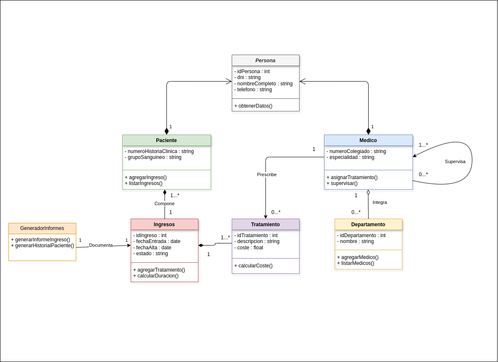

El hospital privado **HealthPlus** desea modelar su sistema interno mediante un **diagrama de clases** UML, basándose exclusivamente en la información siguiente.

El hospital gestiona diferentes **Personas**, de las que se almacena:

- `idPersona : int`
- `dni : string`
- `nombreCompleto : string`
- `telefono : string`
- `obtenerDatos():`

Dentro del sistema existen dos perfiles diferenciados:

**Paciente**
- `numeroHistoriaClinica : string`
- `grupoSanguineo : string`
- `agregarIngreso()`
- `listarIngresos()`

**Médico**
- `numeroColegiado : string`
- `especialidad : string`
- `asignarTratamiento()`
- `supervisar()`

Un paciente puede *tener*  **ingresos**  a lo largo del tiempo, de los cuales se registra:

- `idIngreso : int`
- `fechaEntrada : date`
- `fechaAlta : date`
- `estado : string`
- `agregarTratamiento()`
- `calcularDuracion()`

Cada **ingreso** queda asociado a un único **paciente**.

Un **ingreso**  incluye uno o varios **tratamientos**, de los que se almacena:

- `idTratamiento : int`
- `descripcion : string`
- `coste : float`
- `calcularCoste()`

Los tratamientos se realizan dentro del ingreso en el que fueron *prescritos* y no se contemplan fuera de dicho contexto.

Cada **tratamiento** es *prescrito* por un **médico**.
Un médico puede prescribir tratamientos a distintos pacientes, o no prescribir ninguno.

El hospital se organiza en **departamentos**, de los que se almacena:

- `idDepartamento : int`
- `nombre : string`
- `agregarMedico()`
- `listarMedicos()`

Cada **médico** desarrolla su actividad profesional en un único departamento
Un **departamento** puede estar operativo aunque no tenga **médicos** asignados en un momento determinado.

Dentro del hospital, los **médicos** pueden *supervisar* a otros **médicos**.
Un médico puede estar *supervisado* por otro profesional, aunque no todos desempeñan funciones de supervisión.

El sistema incorpora un componente denominado **GeneradorInformes**, que dispone de:

+ `generarInformeIngreso()`
+ `generarHistorialPaciente()`

Este componente accede a la información de ingresos y pacientes para generar los documentos, pero no forma parte de la estructura clínica del sistema.

