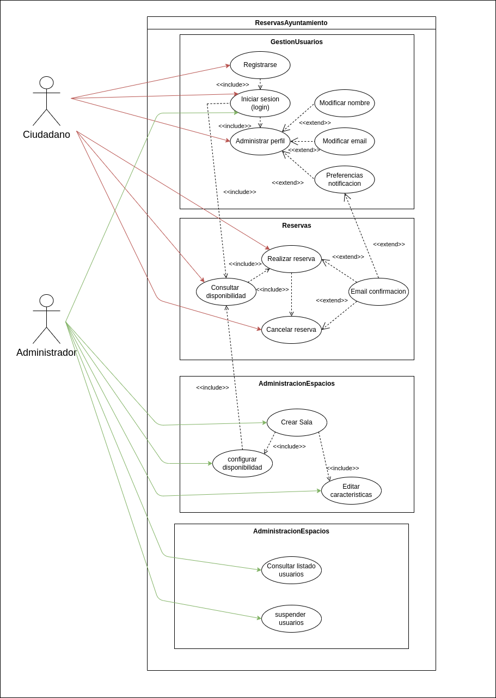

# UT5-PO1 Diagrama de casos de uso

El ayuntamiento quiere implantar una plataforma centralizada para la gestión de reservas en centros culturales municipales (salas de estudio, aulas de ensayo, auditorios, salas de exposiciones, etc.). La plataforma permitirá a los ciudadanos gestionar sus reservas y a los administradores controlar recursos y usuarios.

Lee con detalle la siguiente descripción funcional:

- Los ciudadanos deben poder registrarse en la plataforma, iniciar sesión (login) y admininstrar su perfil, es decir podrán modificar su nombre, modificar su email y modificar sus preferencias de notificación. Se debe tener en cuenta que para administrar el perfil, antes debe haber hecho login.
- Un usuario previamente autenticado puede consultar la disponibilidad de una sala para una fecha y franja horaria específica.
- Si la sala está libre (requisito indispensable), el usuario puede realizar una reserva.
- Al confirmarse una reserva, el usuario recibe un correo electrónico  por parte del sistema. Esto sólo ocurrirá si el usuario ha configurado en su perfil la recepción de notificaciones.
- El ciudadano puede cancelar una reserva ( sólo si ha hecho login previamente ), al hacerlo recibe un correo electrónico de confirmación por parte del sistema. Esto sólo ocurrirá si el usuario ha configurado en su perfil la recepción de notificaciones.
- Para hacer uso de la aplicación y poder llevar a cabo sus gestiones es indispensable que el admininstrador haga login en la aplicación.
- El administrador del sistema puede  admininstrar las salas, pudiendo: crear nuevas salas en los centros culturales, editar sus características y configurar la disponibilidad.
- El administrador puede admininstrar a los usuarios del sistema ( los ciudadanos ), pudiendo: consultar el listado de usuarios de la plataforma y suspender a aquellos que incumplan las normas de uso.

## Objetivos

1. Identifica los **actores** del sistema.
2. Determina los **casos de uso principales** necesarios para cubrir las funciones descritas.
3. Especifica las **relaciones include** y **extend** que consideres necesarias.

## Diagrama

A continucación se muestra el diagrama de casos de uso:

