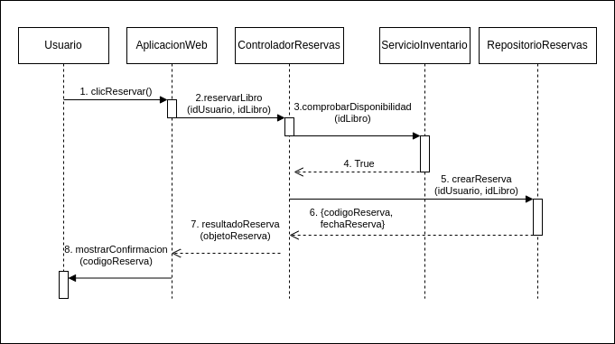

# UT5-PO2 Diagrama de Secuencia UML

Modela un **diagrama de secuencia UML** correspondiente al siguiente **flujo funcional exacto** del sistema.  

- **No se permite omitir, fusionar ni reinterpretar mensajes**.  
- Debes representar **todas las líneas de vida**, **todos los mensajes síncronos**, **todos los retornos** y **todas las condiciones**, **exactamente en el orden indicado**.

## Contexto

Un sistema de gestión de biblioteca permite al usuario reservar un libro mediante la operación **reservarLibro()**.  
El usuario interactúa con una **AplicacionWeb**, que se comunica con un **ControladorReservas**, el cual delega en un **ServicioInventario** y en un **RepositorioReservas**.

Los objetos involucrados ( que deberán aparecer como líneas de vida ) son exactamente:

- Usuario  
- AplicacionWeb  
- ControladorReservas  
- ServicioInventario  
- RepositorioReservas  

No debe añadirse ningún otro objeto.

## Flujo secuencial exacto

Cuando el **Usuario** pulsa el botón “Reservar”, ocurre la siguiente secuencia estricta:

1. El **Usuario** envía a la **AplicacionWeb** la acción `clicReservar()`.

2. La **AplicacionWeb** envía al **ControladorReservas** la petición síncrona  `reservarLibro(idUsuario, idLibro)`.

3. El **ControladorReservas** envía al **ServicioInventario** el mensaje síncrono     `comprobarDisponibilidad(idLibro)`.

4. El **ServicioInventario devuelve un retorno** al ControladorReservas con un valor booleano:

   - `true` si el libro está disponible.  
   - `false` si no lo está.

   El diagrama debe modelar **solo el caso exitoso**, es decir, cuando devuelve **true**.

5. Si la disponibilidad es `true`, el **ControladorReservas** envía al **RepositorioReservas** el mensaje síncrono  
   `crearReserva(idUsuario, idLibro)`.

6. El **RepositorioReservas devuelve un retorno** al ControladorReservas con exactamente el objeto: 
   `{codigoReserva, fechaReserva}`.

7. El **ControladorReservas** envía a la **AplicacionWeb** el retorno `resultadoReserva(objetoReserva)`.

8. La **AplicacionWeb** envía al **Usuario** el mensaje   `mostrarConfirmacion(codigoReserva)`.

## Restricciones obligatorias

- Todos los mensajes deben ser **síncronos** (flecha con punta llena).  
- Todos los retornos deben modelarse con **flecha discontinua**.  
- No debe incluirse ningún tratamiento de errores ni caminos alternativos.  
- El orden debe ser exactamente el descrito.  
- No se debe añadir paralelismo, concurrencia ni mensajes adicionales.

## Diagrama

A continuación se muestra el diagrama de secuencias:

