

# UT3-A1 - Análisis de Entornos de Desarrollo Intergrados (IDE)

***1ºDAM 2025/2026***
***Grupo 1:***
 - ***Iván Mesa Domínguez***
 - ***Daniel Díaz Pierburg***
 - ***Alberto Carballo Hernandez***
 - ***Nauzet Torres Tejera***
 - ***Jorge Hernández Pérez***

## Introducción 

La práctica se centrará en **NetBeans**, un Entorno de Desarrollo Integrado (IDE) que permite a los desarrolladores escribir, depurar y mantener el código de manera eficiente. Exploraremos su evolución, funciones y utilidad en el desarrollo de software.

## Objetivos 

- **Comprender la historia y evolución de NetBeans** a lo largo del tiempo.
- **Documentar el proceso de instalación** en una máquina virtual y los requisitos necesarios.
- **Examinar las características clave** del IDE, incluyendo el editor de código, compilador, depurador, control de versiones y funcionalidades de refactorización.
- **Presentar un ejemplo práctico** de desarrollo de un proyecto en NetBeans.

## Material empleado 

- **Software:**
  - **NetBeans IDE 28** \
    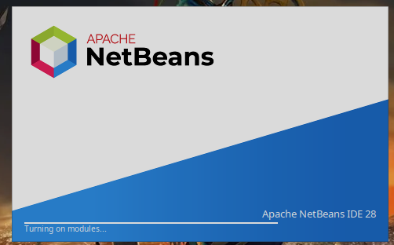 
  - **Java Development Kit (JDK 25)** \
  - 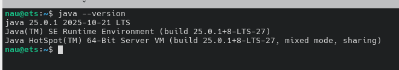 
  
- **Hardware:**
  - Máquien virtual con Debian 13,.

- **Configuraciones:**
  - Configuraciones básicas para el correcto funcionamiento de la máquina virtual.

## Desarrollo 

### Historia y Contexto

- **Año de creación**: NetBeans fue creado en **1996** por una compañía checa llamada **Xelfi**.
- **Autenticidad del desarrollo**: En 2010, fue adquirido por **Oracle Corporation**.
- **Lenguajes/tecnologías orientadas**: Principalmente Java, aunque también soporta PHP, C++, y HTML5.

### Evolución a lo largo del tiempo

- **Versiones principales**:
  - 1997: Lanzamiento de la primera versión.
  - 2000: Incorporación de soporte para Java 2.
  - 2004: Integración como parte del programa de código abierto de Sun Microsystems.
  - 2019: Última versión lanzada bajo la administración de Apache.

### Instalación en una máquina virtual

- **Sistema operativo utilizado**: **Debian 13**.
- **Requisitos mínimos**:
  - Procesador de 2 GHz.
  - 4 GB de RAM.
  - 1 GB de espacio en disco.
  
- **Proceso paso a paso de instalación**:
  1. Descargar e instalar la última versión de NetBeans desde el sitio oficial, en este caso se utilizó el software "snap". \
     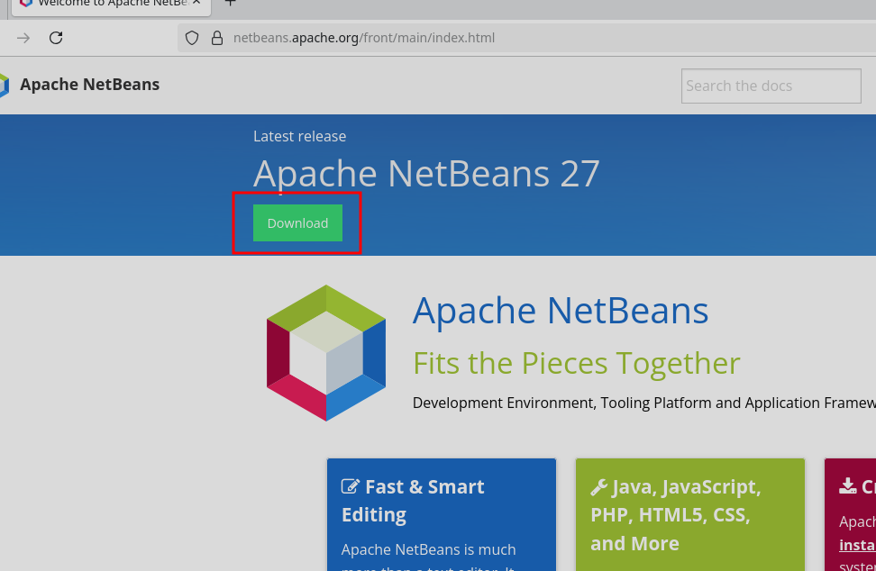
     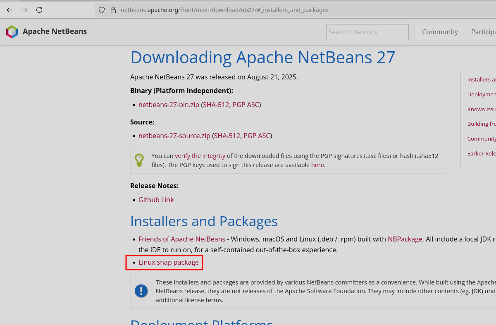
     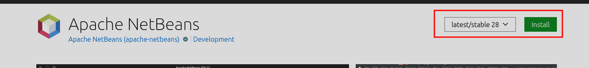
     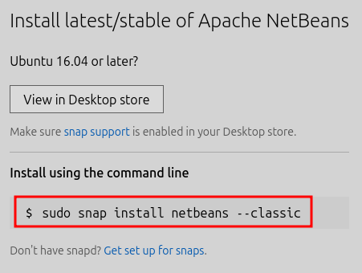
     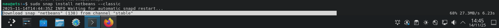
     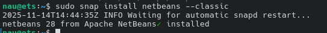
  2. Instalar el JDK si no está presente en la máquina. \
     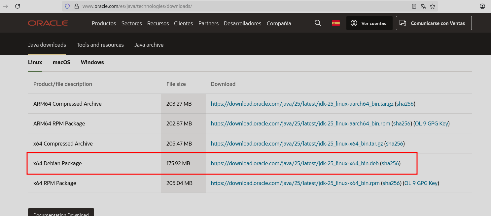
     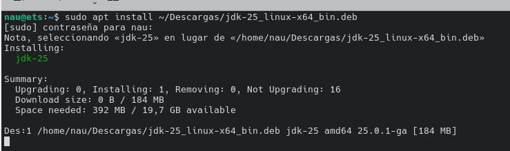
  3. Empezar a utilizar el software.
  
  
### Parte y uso del IDE

**Editor de código: Principales características de NetBeans**

NetBeans es un Entorno de Desarrollo Integrado (IDE) de código abierto, conocido principalmente por su soporte para el lenguaje Java, aunque también es compatible con otros lenguajes como PHP y C/C++.

- **Resaltado de sintaxis y Autocompletado (IntelliSense)**: Proporciona estas características esenciales para múltiples lenguajes, facilitando la codificación rápida y con menos errores.
- **Editor personalizable**: Permite mover y reorganizar ventanas, acoplar paneles y personalizar la interfaz de usuario según las preferencias del usuario.
- **Desarrollo rápido de interfaces de usuario**: Incluye un diseñador visual (GUI Builder) que facilita la creación de interfaces gráficas de usuario, especialmente útil en aplicaciones Java Swing.
- **Gestión de proyectos robusta**: Organiza el código fuente en carpetas específicas (src), gestiona librerías y dependencias (como el JEK de Java y APIs), y crea archivos auxiliares para el entorno.

**Compilador / Intérprete: Cómo se ejecutan y prueban los programas en NetBeans**

NetBeans gestiona automáticamente los procesos de compilación y ejecución, especialmente para proyectos Java que son compilados.

- **Compilación**:
    - NetBeans utiliza el compilador de Java (javac) en segundo plano o bajo demanda.
    - Para compilar el proyecto principal, se puede seleccionar la opción de menú **"Run" > "Build/Compile Main Project"**.
    - El proceso genera archivos de código objeto (.class) y, si se desea, un archivo ejecutable (ej. .jar o .exe) en una carpeta de dist tras una operación de "Clean and Build".
- **Ejecución**:
    - Para ejecutar un programa, se selecciona **"Run" > "Run Main Project"** (o el botón verde de "Play").
    - El IDE ejecuta el archivo compilado (el .class) en una ventana de consola u "Output" dentro del mismo entorno.
    - Cualquier error de compilación debe corregirse en el editor antes de que la ejecución pueda tener lugar con éxito.

**Depurador: Uso básico de breakpoints, inspección de variables, etc. en NetBeans**

El depurador de NetBeans es una herramienta potente para encontrar errores al ejecutar el código paso a paso y examinar el estado del programa.

- **Puntos de interrupción (Breakpoints)**: Se pueden establecer haciendo clic en el margen izquierdo junto al número de línea. El programa se detendrá automáticamente en estos puntos al iniciar la depuración.
- **Inspección de variables**: Cuando el programa se pausa, se puede ver el valor actual de las variables en una ventana dedicada ("Variables" o "Watches"). Esto permite ver cómo cambian los datos a medida que avanza la ejecución.
- **Paso a paso**: El menú "Debug" ofrece opciones como "Step Into" (entrar en una función), "Step Over" (ejecutar la línea actual y pasar a la siguiente), y "Step Out" (salir de la función actual) para controlar el flujo de ejecución.
- **Iniciar depuración**: Se inicia seleccionando **"Debug" > "Debug Main Project"** (o presionando Ctrl + F5).

**Control de versiones: Integración con Git o sistemas similares en NetBeans**

NetBeans ofrece integración nativa y fluida con sistemas de control de versiones populares como Git, Mercurial, SVN y CVS.

- **Integración Git**: Una vez instalado Git en el sistema, se puede habilitar y utilizar directamente desde el IDE.
- **Funcionalidades**: El IDE permite realizar operaciones comunes de VCS a través de menús contextuales o ventanas dedicadas:
    - **Clonar/Inicializar**: Iniciar un repositorio local o clonar uno remoto de plataformas como GitHub.
    - **Commit**: Registrar los cambios realizados en el proyecto.
    - **Push/Pull**: Sincronizar cambios con el repositorio remoto.
    - **Branching/Merging**: Crear, cambiar y fusionar ramas de trabajo de forma gráfica.

**Refactorización: Ejemplos prácticos de uso en NetBeans**

NetBeans automatiza varias operaciones de refactorización para mantener el código limpio y mantenible.

- **Rename (Renombrar)**: La función de refactorización más común. Permite cambiar el nombre de cualquier elemento (clase, método, variable, archivo) y NetBeans actualiza automáticamente todas las referencias en todo el proyecto.
- **Extraer método/función**: Permite seleccionar un bloque de código y convertirlo en un nuevo método, reemplazando el original por la llamada al nuevo método.
- **Extraer variable/constante**: Similar a extraer método, convierte un valor literal o expresión en una variable o constante con un nombre descriptivo.
- **Mover/Cambiar firma**: Herramientas para mover clases entre paquetes o modificar los parámetros de un método de manera segura.

**Plugins o extensiones: Principales complementos disponibles en NetBeans**

Aunque NetBeans es un IDE completo por sí mismo, su funcionalidad se puede ampliar mediante plugins y módulos.

- **Soporte de lenguaje**: Módulos para C/C++, PHP, HTML5/JavaScript, etc., que añaden características específicas de estos lenguajes.
- **Servicios y Bases de Datos**: Integraciones para conectar y administrar bases de datos (MySQL, PostgreSQL, etc.) directamente desde el IDE utilizando JDBC.
- **Servidores de aplicaciones**: Plugins para interactuar con servidores como Apache Tomcat o GlassFish.

**Herramientas Maven/Gradle**: Soporte avanzado para la gestión de proyectos y dependencias mediante estas herramientas de construcción.
### Ejemplo práctico

- **Proyecto simple**: "Probando NetBeans"
  - Un ejemplo básico de cómo crear una aplicación Java que imprime "Probando NetBeans" en la consola.
  - Para crear dicho ejemplo de aplicación realizaremos los siguientes pasos con los que conseguiremos tener el resultado "Probando NetBeans":
    - Primero instalaremos NetBeans, y dentro de este, iremos a Archivo>Nuevo proyecto.
    - Seleccionaremos Java con Ant>Aplicación Java.
    - A continuación pondremos el nombre que mas nos convenga a nuestro nuevo proyecto.
    - Ahora dentro del proyecto, entramos en la carpeta **src**.
    - Creamos un nuevo archivo llamado "Prueba.Java"(cualquier nombre).
    - Dentro de la clase "Prueba" definimos el metodo main, que es el punto de entrada del programa.
    - Y pondremos lo siguiente para que el programa imprima el mensaje que queramos, en este caso colocaremos "Probando NetBens": "System.out.println("Probando NetBeans")"
    - A continuación NetBeans compilará el código al haber presionado "run", para finalmente devolver el mensaje que le hayamos puesto.  
    
  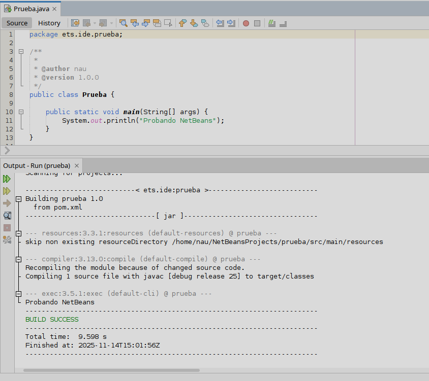
  
### Pros y contras. Uso recomendado

- **Ventajas**:
  - **Interfaz de usuario intuitiva:** La interfaz de NetBeans es fácil de navegar y personalizable, lo que permite a los desarrolladores trabajar de manera eficiente.
  - **Soporte para múltiples lenguajes:** NetBeans ofrece soporte para una amplia variedad de lenguajes, lo que lo hace una opción ideal para proyectos que requieren trabajo con diferentes tecnologías.
  - **Buenas herramientas de depuración:** El depurador de NetBeans es potente y fácil de usar, lo que facilita la identificación y corrección de errores.
  - **Integración con Git:** La integración con Git es fluida y permite a los desarrolladores gestionar sus proyectos de manera efectiva.
  

- **Inconvenientes**:
  - **Puede ser pesado:** NetBeans puede requerir recursos significativos del sistema, lo que puede afectar el rendimiento en máquinas con recursos limitados.
  - **Curva de aprendizaje:** Aunque la interfaz es intuitiva, algunas funcionalidades pueden requerir tiempo para dominarlas, especialmente para principiantes.

- **Contextos de uso recomendado**:
  - **Desarrollo de aplicaciones empresariales en Java:** NetBeans es una excelente opción para desarrollar aplicaciones empresariales en Java, gracias a su soporte para tecnologías como Java EE y Spring.
  - **Proyectos que requieren gestión de código a través de Git:** La integración con Git hace que NetBeans sea una excelente opción para proyectos que requieren gestión de código a través de Git.

## Conclusiones y valoracion final 

Podemos concluir que **NetBeans** es un IDE muy completo y versátil que ofrece una amplia gama de herramientas y funcionalidades para desarrolladores de software. Su soporte para múltiples lenguajes, incluyendo Java, PHP, C++ y HTML5, lo hace una opción atractiva para proyectos de diversa índole.
Aunque tiene sus limitaciones, es una herramienta valiosa para programadores, especialmente en la creación de aplicaciones Java.
