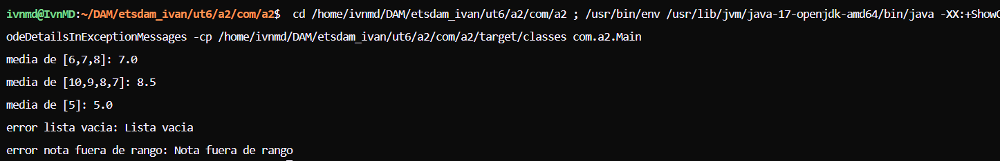

# UT6-A2 Introducción a las pruebas en Java con JUnit

### Objetivo de la práctica

El objetivo es aprender a probar el funcionamiento de un programa usando:

1. pruebas manuales
2. comprobaciones de resultados
3. pruebas automatizadas con `JUnit`

### Descripción del programa

La función recibe una lista de notas y calcula la media. Las reglas son:

- las notas tienen que estar entre 0 y 10
- devuelve la media de todas las notas
- si la lista está vacía lanza un error
- si alguna nota no es válida también lanza un error

```java
public class CalculadoraNotas {

    public static double calcularMedia(int[] notas) {

        if(notas.length == 0){
            throw new IllegalArgumentException("Lista vacía");
        }

        int suma = 0;

        for(int nota : notas){

            if(nota < 0 || nota > 10){
                throw new IllegalArgumentException("Nota fuera de rango");
            }

            suma += nota;
        }

        return suma / notas.length;
    }
}
```

### Pruebas manuales

Código de `Main.java`:

```java
package com.a2;

public class Main {
    public static void main(String[] args) {

        // prueba con varias notas
        double resultado = CalculadoraNotas.calcularMedia(new int[]{6, 7, 8});
        System.out.println("media de [6,7,8]: " + resultado);

        // prueba con decimal
        resultado = CalculadoraNotas.calcularMedia(new int[]{10, 9, 8, 7});
        System.out.println("media de [10,9,8,7]: " + resultado);

        // una sola nota
        resultado = CalculadoraNotas.calcularMedia(new int[]{5});
        System.out.println("media de [5]: " + resultado);

        // lista vacia, deberia dar error
        try {
            CalculadoraNotas.calcularMedia(new int[]{});
        } catch (IllegalArgumentException e) {
            System.out.println("error lista vacia: " + e.getMessage());
        }

        // nota fuera de rango
        try {
            CalculadoraNotas.calcularMedia(new int[]{5, 12});
        } catch (IllegalArgumentException e) {
            System.out.println("error nota fuera de rango: " + e.getMessage());
        }
    }
}
```

Capturas de la terminal:



### Tests con JUnit

Código de `CalculadoraNotasTest.java`:

```java
package com.a2;

import static org.junit.jupiter.api.Assertions.*;
import org.junit.jupiter.api.Test;

public class CalculadoraNotasTest {

    @Test
    void testMediaSimple() {
        assertEquals(7.0, CalculadoraNotas.calcularMedia(new int[]{6, 7, 8}));
    }

    @Test
    void testMediaDecimal() {
        assertEquals(8.5, CalculadoraNotas.calcularMedia(new int[]{10, 9, 8, 7}));
    }

    @Test
    void testUnaNota() {
        assertEquals(5.0, CalculadoraNotas.calcularMedia(new int[]{5}));
    }

    // lista vacia tiene que lanzar excepcion
    @Test
    void testListaVacia() {
        assertThrows(IllegalArgumentException.class,
                () -> CalculadoraNotas.calcularMedia(new int[]{}));
    }

    @Test
    void testNotaFueraDeRango() {
        assertThrows(IllegalArgumentException.class,
                () -> CalculadoraNotas.calcularMedia(new int[]{5, 12}));
    }
}
```

### Ejecución de los tests

```
Tests run: 5
Tests passed: 5
```

### Reflexión final

- ¿Todos tus tests pasan correctamente?

Sí, los 5 pasan sin errores.

- En caso de que alguno falle, explica por qué.

Al principio el test `testMediaDecimal` fallaba porque el código original devolvía `int` en vez de `double`, así que `34 / 4` daba `8` en lugar de `8.5`.

- ¿Has detectado algún error en el código proporcionado? Explica cuál es.

Sí, el tipo de retorno era `int` y la división entera trunca el resultado. Para que funcione bien hay que cambiarlo a `double` y añadir el cast:

```java
public static double calcularMedia(int[] notas) {
    ...
    return (double) suma / notas.length;
}
```
