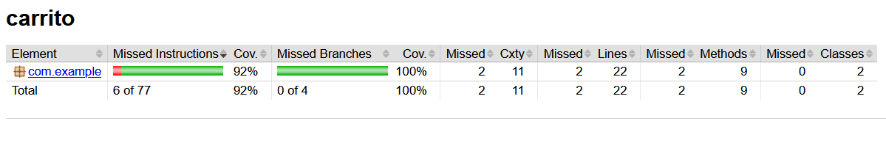
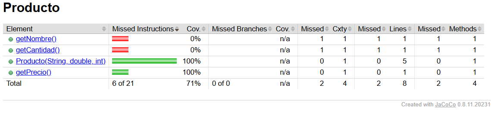

# UT6-A4 Diseño de tests para un gestor de carrito de compra (Java + Maven + JaCoCo)

### Contexto

Una tienda online está desarrollando un pequeño módulo en **Java** que gestiona el cálculo del importe de un carrito de compra.

El equipo de desarrollo ha implementado varias funciones, pero el equipo de QA (vosotros) debe diseñar los tests que verifiquen su correcto funcionamiento.

El objetivo de esta práctica es diseñar e implementar una batería completa de tests usando **JUnit 5** y comprobar la cobertura de código con **JaCoCo** integrado en Maven.


### Comportamiento del sistema

El módulo permite realizar las siguientes operaciones:

#### 1. Calcular el subtotal de un carrito

**Método:** `calcularSubtotal(List<Producto> carrito)`

El carrito es una lista de objetos `Producto`.

Cada producto contiene:
- `nombre` (String)
- `precio` (double)
- `cantidad` (int)

Ejemplo:

```java
List<Producto> carrito = List.of(
    new Producto("teclado", 30, 2),
    new Producto("raton", 10, 1)
);
```

El subtotal se calcula realizando la operación:

```
precio * cantidad
```

para cada producto y sumando los resultados.


#### 2. Aplicar descuento

**Método:** `aplicarDescuento(double subtotal, double descuento)`

El descuento es un porcentaje entre **0 y 100**.

Ejemplo:

```
subtotal = 100
descuento = 10

resultado = 90
```


#### 3. Calcular gastos de envío

**Método:** `calcularEnvio(double subtotal)`

- Si `subtotal >= 100` → envío gratis (0€)
- Si `subtotal < 100` → envío 5€


#### 4. Calcular total del pedido

**Método:** `calcularTotal(List<Producto> carrito, double descuento)`

El proceso que se debe cumplir es:

```
SUBTOTAL -> APLICAR DESCUENTO -> AÑADIR ENVÍO
```


### Trabajo a realizar

Debes diseñar una batería de tests utilizando **JUnit 5** que verifique el comportamiento del sistema.

Tus tests deben cubrir al menos los siguientes casos:

#### Subtotal
- carrito con varios productos
- carrito con un solo producto
- carrito vacío

#### Descuentos
- descuento 0%
- descuento válido
- descuento 100%
- descuento inválido (ej: negativo o mayor de 100)

#### Envío
- subtotal menor que 100
- subtotal mayor o igual que 100

#### Total del pedido
- pedido sin descuento
- pedido con descuento
- pedido con envío gratis


### Requisitos técnicos

- Proyecto gestionado con **Maven**
- Tests implementados con **JUnit 5**
- Estructura estándar:

```
src/main/java
src/test/java
```

- Debes crear una clase de test, por ejemplo:

```
CarritoTest.java
```

- Debes implementar **al menos 12 tests distintos**


### Cobertura de código con JaCoCo

Una vez implementados los tests debes analizar qué porcentaje del código está siendo ejecutado por las pruebas.

Para ello utilizaremos **JaCoCo**.

Ejecuta el siguiente comando en la terminal:

```
mvn clean test
```

Después abre el informe generado en:

```
target/site/jacoco/index.html
```

Incluye una **captura de pantalla** del informe de cobertura donde se vea:

- porcentaje de cobertura
- clases analizadas


### Análisis de errores detectados

Durante la ejecución de los tests es posible que algunos de ellos fallen. Esto puede indicar que el código contiene errores.

Responde a las siguientes preguntas en este documento:

#### 1. Tests que han fallado

- Indica qué tests han fallado durante la ejecución inicial
- Explica brevemente por qué esos tests deberían pasar según el comportamiento descrito

Han fallado 6 de los 15 tests ejecutados:

- **`testSubtotalVariosProductos`** — devuelve 40.0 en lugar de 70.0. Debería pasar porque el enunciado indica que el subtotal es `precio × cantidad` por producto. El teclado (30€ × 2) y el ratón (10€ × 1) suman 70€, no 40€.
- **`testSubtotalUnProducto`** — devuelve 200.0 en lugar de 600.0. Un monitor de 200€ con cantidad 3 debe sumar 600€.
- **`testEnvioSubtotalExactamente100`** — devuelve 5.0 en lugar de 0.0. El enunciado especifica `>= 100` como condición de envío gratis, por lo que 100€ exactos deben tener envío gratuito.
- **`testDescuentoNegativoLanzaExcepcion`** — no lanza excepción. El descuento debe estar entre 0 y 100; un valor negativo es inválido y debería ser rechazado.
- **`testDescuentoMayorDe100LanzaExcepcion`** — no lanza excepción. Un descuento de 150% es inválido por la misma razón.
- **`testTotalConDescuentoEnvioGratis`** — devuelve 41.0 en lugar de 68.0. Es consecuencia del bug en `calcularSubtotal`: al calcular mal el subtotal (40€ en vez de 70€), el total resultante también es incorrecto.

#### 2. Identificación de errores en el código

Si has detectado errores en el programa, indica:

- en qué método se encuentran
- qué línea del código es incorrecta
- por qué produce un resultado incorrecto

**Error 1 — `calcularSubtotal()`**
```java
subtotal += p.getPrecio(); // línea incorrecta
```
Solo acumula el precio unitario, ignorando la cantidad. Si hay 3 unidades de un producto, debería sumar `precio × 3` pero suma solo `precio`.

**Error 2 — `calcularEnvio()`**
```java
if (subtotal > 100) // línea incorrecta
```
El operador `>` excluye el valor límite. Con un subtotal de exactamente 100€ la condición es `false` y cobra 5€ de envío cuando debería ser gratuito.

**Error 3 — `aplicarDescuento()`**
```java
return subtotal - (subtotal * descuento / 100); // sin validación previa
```
No comprueba si el descuento está en el rango válido (0–100), por lo que acepta valores negativos o superiores a 100 sin ningún error.

#### 3. Corrección propuesta

Explica cómo se debería corregir el código para que el comportamiento sea el esperado.

Incluye el fragmento de código corregido.

**Corrección 1 — multiplicar precio por cantidad:**
```java
subtotal += p.getPrecio() * p.getCantidad();
```

**Corrección 2 — cambiar `>` por `>=`:**
```java
if (subtotal >= 100) {
    return 0;
} else {
    return 5;
}
```

**Corrección 3 — añadir validación del descuento:**
```java
public double aplicarDescuento(double subtotal, double descuento) {
    if (descuento < 0 || descuento > 100) {
        throw new IllegalArgumentException("Descuento inválido: debe estar entre 0 y 100");
    }
    return subtotal - (subtotal * descuento / 100);
}
```

#### 4. Resultado final

Tras diseñar los tests y analizar el código:

- ¿cuántos tests has implementado? **15 tests**
- ¿qué porcentaje de cobertura has obtenido? 
 

 - **92% de instrucciones y 100% de ramas.** Las únicas instrucciones no cubiertas son los métodos `getNombre()` y `getCantidad()` de la clase `Producto`, que no son invocados directamente por los tests ya que no forman parte de la lógica de negocio probada:

 - 

- ¿todos los tests pasan correctamente? **No con el código original, solo 9 de 15 pasan. Con el código corregido los 15 pasan correctamente.**


### Entrega

Debes subir a tu repositorio de GitHub, en la carpeta correspondiente:

- Código fuente del proyecto
- Tests implementados
- Archivo `pom.xml`
- Captura de cobertura JaCoCo
- Documento con el análisis realizado